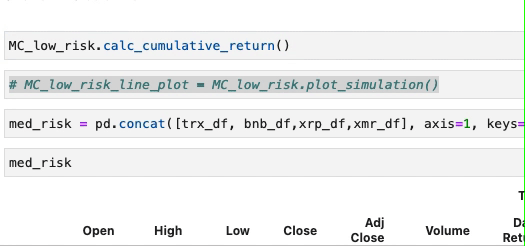
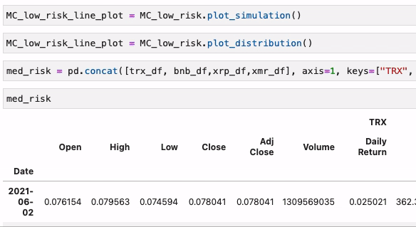
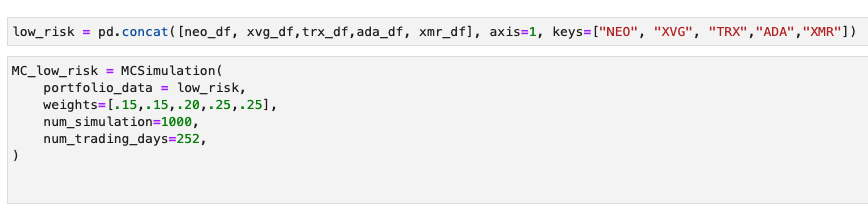
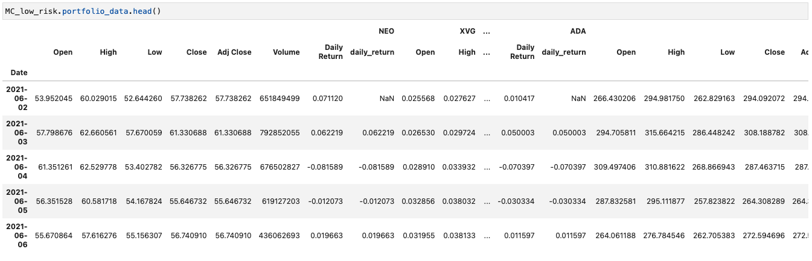

# Crypto Portfolio Analyzer
## Background

**Smart exposure to digital currencies**, This application uses an interactive command line interface to collect investment information from the user; it then recomends a cryptocurrency portfolio based on risk levels, and by analyzing real-time data using API calls.  This Crypto porfolio analyzer is an innovative addition to the fintech industry. We want to offer optimized cryptocurrency porfolios to everyone, even those who lack the financial knowledge and understanding of cryptocurrencies. We plan to build additional features into this like the ability to link to cryptocurrency wallets, and buying/selling with a cryptocurrency trading bot using machine learning.

## Table of Contents
1. [Front-end Interface](#1-Front-end-Interface)

2. [Calculate and Plot the output from the CLI.](#2-Calculate-and-Plot-the-output-from-the-CLI)

3. [Simulation Trajectories.](#3-Simulation-Trajectories)

4. [Back-End Functionality.](#4-Back-End-Functionality)

5. [Compose the data story.](#5-compose-the-data-story)

---

## 1. Front-end Interface

* The CLI python script is located here **File:** [Crypto Porfolio CLI](/appy2.py)
* If then statement was built to personlize the type of investment to user wanted
    
  

## 2. Calculate and Plot the output from the CLI

* The output python script is located here **File:** [Crypto Results Porfolio](/results.py)

 )
* API used on this project are as follows
   * yfinance
   * sqlalchemy
   * requests
   * datetime
   * statistics 
   
* The website used for gather crypto data
   * alternative
   
* Create a new DataFrame named `stocks_dataframe` by creating these columns and display the appropiate date.
   * Coins	
   * Symbol	
   * Category	
   * Price	
   * 24Hr Volume	Market Caplization	
   * 1hr % Change	
   * 24hrs %Change	
   * 7days %Change	
   * Sharpe Ratio	
   * Variance
   
* Bar chart was created with predetermined currencies 
* The % this portfolio has made within 1 year period
* The line graph that shows how much money that would have been made if the user invested 1 year prior

## 3. Simulation Trajectories

* The output python script is located here **File:** [MC Database](./mc_database.ipynb.py)

These clips demonstrate the simulator running on our pre-selected portfolio data.
Careful usage of this functionality can enhance our users ability to make informed long term portfolio selections.

---

---

## 4. Back-End Functionality

The following portions of code demonstrate how we use historical data to project possible portfolio returns.

## 5. Compose the Data Story

We are giving the average person the opportunity to invest into cryptocurrency without the high-risk crypto is associated with. Our portfolios are designed to minimize long-term risk while benefiting from the accumulated growth of Bitcoin, Ethereum, Litecoin, and other leading cryptocurrencies.
Tired of hearing about stocks that already made investors a lot of money? Our Crypto Porfolio Advisor picks top value stocks with strong long-term growth potential.

Utilizing real-time data users will have access to their own personal crypto advisor at the palm of their hands, or on their computer.

## Contributors
Mykal Morton, Vicky Lee, Jay Wiley, Jeremy Pierce.
